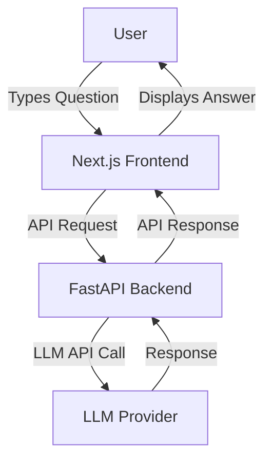

# pawait-llm-qa-app

A modern, production-ready full-stack Q&A web application powered by FastAPI (backend) and Next.js + TailwindCSS + TypeScript (frontend), integrating an LLM (Language Learning Model) for AI-generated responses.

**GitHub Repository:** [https://github.com/Cypherfelix/pawait-llm-qa-app](https://github.com/Cypherfelix/pawait-llm-qa-app)

---

## Table of Contents

- [Project Overview](#project-overview)
- [Architecture](#architecture)
- [Backend Documentation](#backend-documentation)
  - [Features](doc/backend/features.md)
  - [Tasks](doc/backend/tasks.md)
  - [Requirements](doc/backend/requirements.md)
  - [Testing](doc/backend/testing.md)
  - [Implementation](doc/backend/implementation.md)
- [Frontend Documentation](#frontend-documentation)
  - [Features](doc/frontend/features.md)
  - [Tasks](doc/frontend/tasks.md)
  - [Requirements](doc/frontend/requirements.md)
  - [Testing](doc/frontend/testing.md)
  - [Implementation](doc/frontend/implementation.md)
- [Deployment Strategy](#deployment-strategy)
- [Contributing](#contributing)
- [License](#license)

---

## Project Overview

**pawait-llm-qa-app** is a full-stack application that allows users to input questions and receive AI-generated answers using an LLM. The project demonstrates modern web development practices, clean code, and effective API integration. It is designed for scalability, maintainability, and ease of deployment.

---

## Architecture



- **Frontend:** Next.js (TypeScript, TailwindCSS) for a modern, responsive UI.
- **Backend:** FastAPI (Python) for robust, high-performance API endpoints.
- **LLM Integration:** Easily switchable between providers (OpenAI, Gemini, etc.).
- **Deployment:** Ready for Vercel, Netlify, Render, Railway, or Docker.

---

## Backend Documentation

- [Features](doc/backend/features.md)
- [Tasks](doc/backend/tasks.md)
- [Requirements](doc/backend/requirements.md)
- [Testing](doc/backend/testing.md)
- [Implementation](doc/backend/implementation.md)

## Frontend Documentation

- [Features](doc/frontend/features.md)
- [Tasks](doc/frontend/tasks.md)
- [Requirements](doc/frontend/requirements.md)
- [Testing](doc/frontend/testing.md)
- [Implementation](doc/frontend/implementation.md)

## Deployment Strategy

### Overview

Our deployment strategy is designed for speed, reliability, and zero-cost hosting during development and demonstration phases. We leverage modern cloud platforms that integrate seamlessly with GitHub for CI/CD and environment management.

---

### Architecture Diagram

```mermaid
graph TD
    A[User] -->|HTTPS| B[Vercel (Next.js Frontend)]
    B -->|API Request| C[Railway (FastAPI Backend)]
    C -->|LLM API| D[LLM Provider (OpenAI)]
```

---

### Frontend (Next.js)

- **Platform:** Vercel
- **Why:** Vercel is optimized for Next.js, offers instant global deployment, automatic HTTPS, and a generous free tier. It supports environment variables and integrates directly with GitHub for continuous deployment.
- **Strategy:** Every push to the main branch triggers an automatic build and deployment. Environment variables (such as the backend API URL) are managed securely in the Vercel dashboard.

---

### Backend (FastAPI)

- **Platform:** Railway
- **Why:** Railway provides a fast, free, and developer-friendly platform for Python web apps. It supports automatic deployments from GitHub, easy environment variable management, and public URLs for API access.
- **Strategy:** The backend is deployed as a web service. On each push to the main branch, Railway builds and redeploys the FastAPI app. Environment variables (such as LLM API keys) are managed securely in the Railway dashboard.

---

### Key Points

- **CI/CD:** Both frontend and backend are continuously deployed from GitHub.
- **Environment Variables:** Managed securely on each platform, never committed to code.
- **Scalability:** Both platforms allow for easy scaling or migration to paid plans if needed.
- **Custom Domains:** Supported on both Vercel and Railway for production readiness.

---

## Contributing

Contributions are welcome! Please open issues or submit pull requests via [GitHub](https://github.com/Cypherfelix/pawait-llm-qa-app).

## License

This project is licensed under the MIT License.
